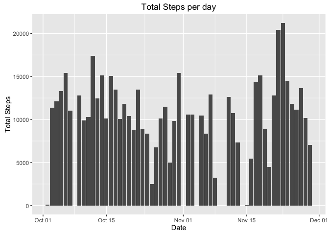
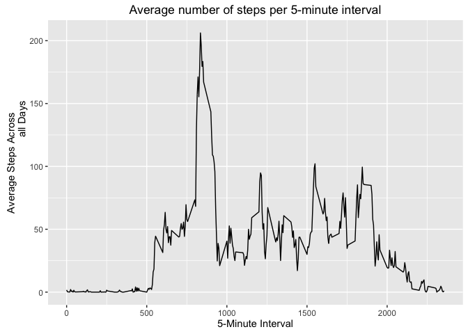
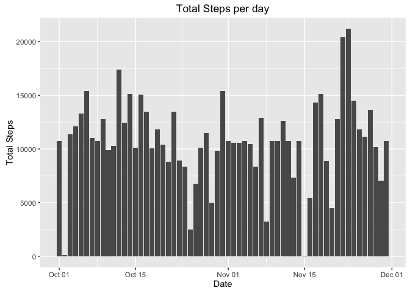
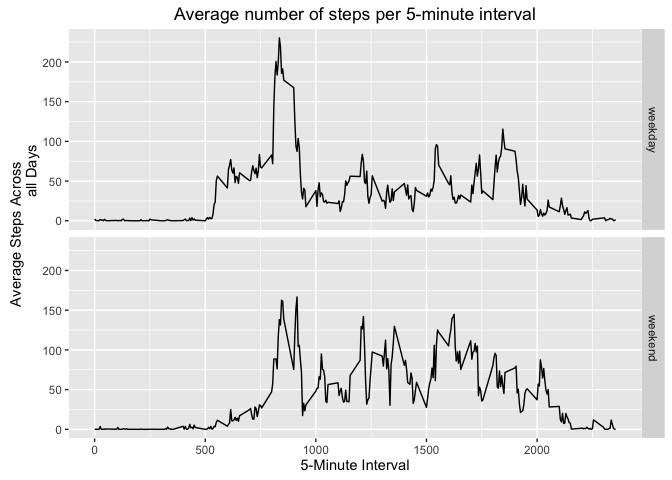

# Reproducible Research - Peer Assessment 1
Giovani Ferreira  
September 28th, 2016  


### A) Loading Libraries
This chunk loads the libraries needed for the analysis

```r
library(dplyr)
```

```
## 
## Attaching package: 'dplyr'
```

```
## The following objects are masked from 'package:stats':
## 
##     filter, lag
```

```
## The following objects are masked from 'package:base':
## 
##     intersect, setdiff, setequal, union
```

```r
library(ggplot2)
```


### B) Loading and preprocessing the data
This chunk reads in the data that is located under data/activity.csv 
Then it transforms the date variable
After that it converts the activity object into a tbl for dplyr and groups it
by date


```r
activity <- read.csv("data/activity.csv", header=TRUE, na.strings="NA")
activity$date <- as.Date(as.character(activity$date), format="%Y-%m-%d")
activity <- tbl_df(activity)
activity <- group_by(activity, date)
```


### C) What is mean total number of steps taken per day?
Ignoring all the missing values, this code creates a totalsteps object containing
a summary of total steps grouped by day.


```r
totalsteps <- summarize(activity[complete.cases(activity),], total.steps=sum(steps))
```

####1. Make a histogram of the total number of steps taken each day


```r
gtotalsteps <- ggplot(data = totalsteps, aes(date,total.steps))
gtotalsteps + geom_bar(stat="identity") + labs(title = "Total Steps per day",
                                               x = "Date", y = "Total Steps")
```

<!-- -->

####2. Calculate and report the **mean** and **median** total number of steps taken per day


```r
mean(totalsteps$total.steps)
```

```
## [1] 10766.19
```

```r
median(totalsteps$total.steps)
```

```
## [1] 10765
```

### D) What is the average daily activity pattern?

####1. Make a time series plot (i.e. `type = "l"`) of the 5-minute interval (x-axis) and the average number of steps taken, averaged across all days (y-axis)

This chunk will group activity by time interval, then it'll create an averageactivity
object containing a summary of average (mean) steps taken each day grouped by time
interval.

After that it'll create a ggplot plot line plot.


```r
activity <- group_by(activity,interval)
averageactivity <- summarize(activity, average.steps = mean(steps, na.rm = TRUE))
gaverage <- ggplot(data = averageactivity, aes(interval,average.steps))
gaverage + geom_line() + labs (title = "Average number of steps per 5-minute interval",
                               x = "5-Minute Interval", y = "Average Steps Across
                               all Days")
```

<!-- -->

####2. Which 5-minute interval, on average across all the days in the dataset, contains the maximum number of steps?

This chunk will find out which is the 5-minute interval on average across all the days that contains the maximum number the steps.

It'll do so by arranging the averageactivity object by average steps in descending  order `desc()` using `arrange()` from dplyr.

It only prints the first row, containing both the interval and the average steps for that interval, using the [1,] subset method.


```r
arrange(averageactivity, desc(average.steps))[1,]
```

```
## # A tibble: 1 × 2
##   interval average.steps
##      <int>         <dbl>
## 1      835      206.1698
```


### E) Imputing missing values

####1. Calculate and report the total number of missing values in the dataset (i.e. the total number of rows with `NAs`)

This chunk will sum all the Steps with missing values

```r
sum(is.na(activity$steps))
```

```
## [1] 2304
```


####2. Devise a strategy for filling in all of the missing values in the dataset. The strategy does not need to be sophisticated. For example, you could use the mean/median for that day, or the mean for that 5-minute interval, etc.

For filling in all missing values I'll use the mean for the specific interval using the averageactivity object created previously.

####3. Create a new dataset that is equal to the original dataset but with the missing data filled in.

The for loop bellow will run through all the $steps on activity2 checking if it's NA.
If it's NA it'll find the average number of steps taken on that particular interval using the averageactivity object created previously and replace the NA value with that value


```r
activity2 <- activity
for(i in seq_along(activity2$steps)){
        if (is.na(activity2[[i,1]])) {
                activity2[[i,1]] <- filter(averageactivity, interval == 
                                                   activity2[[i,3]])$average.steps
        }
}
activity2 <- group_by(activity2, date)
```

####4. Make a histogram of the total number of steps taken each day and Calculate and report the **mean** and **median** total number of steps taken per day. 

For this part I'll repeat the approach of the item C above


```r
totalsteps2 <- summarize(activity2, total.steps=sum(steps))
```


```r
gtotalsteps2 <- ggplot(data = totalsteps2, aes(date,total.steps))
gtotalsteps2 + geom_bar(stat="identity") + labs(title = "Total Steps per day",
                                               x = "Date", y = "Total Steps")
```

<!-- -->


```r
mean(totalsteps2$total.steps)
```

```
## [1] 10766.19
```

```r
median(totalsteps2$total.steps)
```

```
## [1] 10766.19
```

####4i. Do these values differ from the estimates from the first part of the assignment? 
The mean is the same, the median is slightly higher


```r
mean(totalsteps2$total.steps) / mean(totalsteps$total.steps)
```

```
## [1] 1
```

```r
median(totalsteps2$total.steps) / median(totalsteps$total.steps)
```

```
## [1] 1.00011
```

####4ii. What is the impact of imputing missing data on the estimates of the total daily number of steps?

Actually there were no significant impact.

### F) Are there differences in activity patterns between weekdays and weekends?

####1. Create a new factor variable in the dataset with two levels -- "weekday" and "weekend" indicating whether a given date is a weekday or weekend day.
 

```r
wkend <- c("Sat","Sun")
activity2$wk <- as.factor(ifelse(weekdays(activity2$date,abbreviate = TRUE) %in% wkend, 
                       c("weekend"), c("weekday")))
```

####2. Make a panel plot containing a time series plot (i.e. `type = "l"`) of the 5-minute interval (x-axis) and the average number of steps taken, averaged across all weekday days or weekend days (y-axis).


```r
activity2 <- group_by(activity2,interval,wk)
averageactivity2 <- summarize(activity2, average.steps = mean(steps))
gaverage2 <- ggplot(data = averageactivity2, aes(interval,average.steps))
gaverage2 + geom_line() + labs (title = "Average number of steps per 5-minute interval",
                               x = "5-Minute Interval", y = "Average Steps Across
                               all Days") + facet_grid(wk ~ .)
```

<!-- -->
